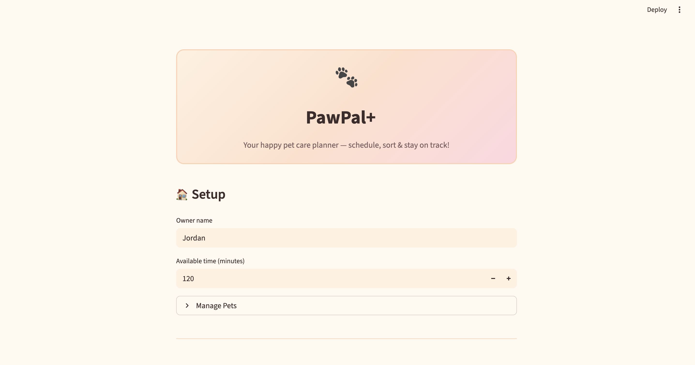

# PawPal+

**An AI-assisted pet care scheduling system built with Python and Streamlit.**

PawPal+ began as a structured task management app for pet owners — allowing them to log care tasks, generate a priority-sorted daily schedule, and detect scheduling conflicts across multiple pets. The original system focused on core scheduling logic: greedy time-budget packing, multi-key task sorting, recurring task recurrence, and conflict detection across time slots.

The enhanced version layers three AI-powered features on top of that foundation — natural-language task explanations, a RAG-based pet care chatbot, and a confidence scoring system — without modifying a single line of the original scheduling engine.

---

## What PawPal+ Does

PawPal+ helps a busy pet owner stay consistent with daily pet care. The owner enters their available time, adds pets, and logs tasks (walks, feeding, grooming, enrichment, medical). The app then:

- **Generates a priority-sorted daily plan** that fits within the owner's available time budget
- **Detects scheduling conflicts** — same-pet overlap, cross-pet overlap, and slot overflow — with actionable warnings
- **Explains each scheduled task** in plain English using an AI engine that considers category, priority, and time of day
- **Scores schedule confidence** from 0 to 1 based on coverage, time utilisation, and absence of conflicts
- **Answers pet care questions** through a built-in chatbot backed by a curated knowledge base (RAG-lite)

---

## Architecture Overview

```
app.py  (Streamlit UI)
│
├── pawpal_system.py      Core domain logic
│   ├── Task              Attributes: title, duration, priority, category, time slot, frequency
│   ├── Pet               Owns a list of Tasks
│   ├── Owner             Owns a list of Pets + available time budget
│   └── Scheduler         generate_plan · detect_conflicts · compute_confidence · filter_tasks
│
├── ai_engine.py          AI explanation layer
│   └── AIEngine          explain_task(task) · explain_schedule(plan)
│
├── retriever.py          RAG retrieval layer
│   └── PetCareRetriever  retrieve(query) — keyword scoring over JSON knowledge base
│
└── pet_knowledge.json    12 curated pet care tips (dogs, cats, feeding, grooming, enrichment)
```

**Data flow:**

1. The user fills in owner details and adds pets and tasks via the Streamlit UI.
2. `app.py` rebuilds domain objects (`Owner`, `Pet`, `Task`) from session state on every render.
3. Clicking **Generate schedule** calls `Scheduler.generate_plan()`, which returns a sorted, time-bounded list of `Task` objects.
4. `Scheduler.compute_confidence()` receives the plan and the full due-task list and returns a 0–1 score.
5. The plan is passed to `AIEngine`, which generates a natural-language explanation per task and a summary paragraph for the full schedule.
6. In the chatbot panel, user questions are passed to `PetCareRetriever.retrieve()`, which scores every tip in `pet_knowledge.json` by keyword overlap and returns the top matches.

Each layer is independent — the scheduler has no knowledge of the AI engine, and the AI engine has no knowledge of the retriever. `app.py` is the only file that wires them together.

---

## Setup

```bash
# 1. Clone the repository
git clone https://github.com/your-username/pawpal-plus.git
cd pawpal-plus

# 2. Create and activate a virtual environment
python -m venv .venv
source .venv/bin/activate        # Windows: .venv\Scripts\activate

# 3. Install dependencies
pip install -r requirements.txt

# 4. Launch the app
streamlit run app.py
```

The app will open at `http://localhost:8501` in your browser.

> **Requirements:** Python 3.10+, `streamlit >= 1.30`, `pytest >= 7.0`

---

## Sample Interactions

### 1 — AI explanation of a scheduled task

**Setup:** Owner adds a high-priority morning walk for Mochi (dog) and clicks Generate schedule.

**Task row in plan:**

```
#1 | Morning | Morning walk | Mochi | 30 min | High | Daily
```

**AI Insights panel output:**

```
Morning walk (for Mochi)
Regular walks keep energy levels balanced and support joint health.
Starting it in the morning sets a positive tone for the rest of the day.
```

---

### 2 — Schedule reasoning insight

**Setup:** Same plan, three tasks scheduled across morning and afternoon.

**"Why was this schedule built this way?" expander:**

```
Tasks were ranked by urgency: 2 high-priority task(s) (Morning walk, Feeding),
then 1 medium-priority task(s). Time constraints shaped the order: 2 task(s)
in the morning, 1 task(s) in the afternoon, totalling 60 minutes across
1 pet(s) (Mochi).
```

---

### 3 — Chatbot RAG question

**User types:** `How often should I walk my dog?`

**PawPal chatbot replies:**

```
• Dogs need at least 30 minutes of walking per day. Regular walks support
  cardiovascular health, healthy weight, and reduce anxiety-driven behaviours
  like chewing or barking.

• Puppies under six months benefit from short, frequent walks of 5 minutes
  per month of age. Early socialisation during walks builds confidence and
  reduces fear-based aggression.
```

---

### 4 — Confidence score output

**Setup:** 4 due tasks, 3 scheduled, no conflicts, 75 of 120 minutes used.

```
🤖 AI Confidence Score
0.83
```

Breakdown: coverage = 0.75 · utilisation = 0.63 · conflict = 1.0 → average = 0.79 (values vary with each run).

---

## Design Decisions

### AI integrated without touching the scheduler

The `Scheduler` class is the tested, stable core of the system. Modifying it to generate language or score confidence inline would have coupled unrelated concerns and risked breaking 29 passing tests. Instead, `AIEngine` and `compute_confidence` consume the scheduler's output as read-only inputs — the scheduler remains a pure planning engine.

### Keyword retrieval instead of embeddings

A vector embedding approach (e.g. sentence-transformers + FAISS) would provide more semantically flexible retrieval, but it introduces a heavy dependency, requires a model download, and adds latency on every query. For a 12-tip knowledge base, keyword scoring — **+2 per tag match, +1 per word match in the tip text** — is fast, fully transparent, and produces accurate results for the narrow pet care domain. It can be swapped for embeddings later without changing the `retrieve()` interface.

### Modular architecture

Separating `AIEngine`, `PetCareRetriever`, and `Scheduler` into distinct files means each can be tested, replaced, or extended independently. `app.py` acts as a thin integration layer: it calls each component, collects outputs, and renders them — it contains no business logic of its own.

### Trade-offs

| Decision                | Benefit                                            | Trade-off                                                  |
| ----------------------- | -------------------------------------------------- | ---------------------------------------------------------- |
| No external AI APIs     | Zero latency, works offline, no API key management | Explanations are template-based, not generative            |
| Keyword RAG             | Simple, interpretable, no dependencies             | Less flexible than semantic search for paraphrased queries |
| Greedy scheduler        | Predictable, fast, easy to test                    | Not globally optimal — may miss better task combinations   |
| Streamlit session state | Simple persistence within a session                | No database; data is lost on page refresh                  |

---

## Testing Summary

Run the full test suite:

```bash
python -m pytest
```

| Area                    | What is covered                                                                                                                  |
| ----------------------- | -------------------------------------------------------------------------------------------------------------------------------- |
| **Sorting correctness** | Plan returns tasks in chronological slot order, higher priority first, shorter duration as tiebreaker                            |
| **Recurrence logic**    | Completing a daily task creates a new task due tomorrow; weekly/monthly offsets are correct; one-time tasks produce no follow-up |
| **Conflict detection**  | Same-pet overlap, cross-pet overlap, and slot overflow all produce warnings; tasks within budget produce none                    |
| **Greedy packing**      | Tasks are selected by priority until the time budget is full; exact-fit, one-over, and over-budget boundaries are verified       |
| **Filtering**           | Combined pet + status + category filters return the correct subset; nonexistent values return empty lists                        |
| **Edge cases**          | Pet with no tasks, owner with no pets, all tasks completed, unknown time slots, invalid filter values                            |

**What worked well:** The scheduling engine was solid enough that all AI features could be added purely as consumers of its output. The modular design made it straightforward to integrate `AIEngine` and `PetCareRetriever` into the UI without regression.

**Challenges:** The main integration challenge was keeping `compute_confidence` honest — it needed access to both the generated plan _and_ the original due-task list to calculate coverage. This meant passing both from `app.py` rather than relying solely on internal scheduler state. Balancing the three confidence components (coverage, utilisation, conflict penalty) required deliberate choices about weighting so the score remained interpretable.

**What was learned:** Designing for testability from the start pays dividends when adding AI layers. Because the scheduler had a clean interface, the AI engine could be written and tested in isolation before ever being wired into the UI.

---

## Reflection

Building PawPal+ reinforced a principle that is easy to state but harder to practice: **AI should augment a system, not be entangled with it.** The most important design decision made throughout this project was keeping the scheduling engine completely unaware of the AI layer. That boundary meant the core logic could be verified by automated tests while the AI features were developed and iterated on freely. It also made the confidence score meaningful — it measures what the scheduler actually did, not what the AI said about it. Working within the constraints of a simple keyword retriever and template-based explanations, rather than reaching for embeddings or a language model API, was a deliberate exercise in proportionate engineering: choosing the simplest solution that honestly solves the problem, and understanding exactly where and why a more powerful approach would be warranted.

---

## Demo



---

## 🧠 Reflection and Ethics

### Limitations and Biases

PawPal+ works well within the boundaries it was designed for, but those boundaries are narrow and worth being honest about.

**What the system cannot do well:**
- The keyword retriever fails silently on paraphrased or contextually phrased questions. Typing "my dog needs exercise" returns no results because neither "exercise" nor "needs" appears in the tag list — only "walk" or "dog" would match. Users who do not know the right vocabulary get nothing, with no signal that they are close.
- The AI explanations are template-driven, not generative. Every "walk" category task receives the same sentence regardless of the dog's breed, age, or health history. A senior dog with arthritis and a healthy puppy get identical advice.
- The confidence score is a proxy, not a ground truth. A plan can score 0.90 and still be genuinely bad — for example, if all three high-priority tasks are medical but the owner only has 15 minutes, the score reflects efficient use of that 15 minutes, not whether the pet's needs were met.

**Possible biases:**
- **Prioritisation logic** assumes that "high" priority tasks are always more important than "medium" ones. In reality, a daily feeding (medium priority, short duration) may matter more to a pet's welfare than a monthly grooming appointment (marked high by a user who wants it done). The system takes user-assigned priority at face value without questioning it.
- **Keyword retrieval** is biased toward the vocabulary in `pet_knowledge.json`. Tips about dogs and cats are well-covered; topics like rabbits, birds, or reptiles return nothing. A user with a non-standard pet receives no guidance rather than an honest "I don't know."
- **Template explanations** repeat the same framing for every task in a category, which can make the AI Insights section feel authoritative even when the advice does not apply to a specific animal or situation.

---

### Misuse Risk and Prevention

**How the system could be misused:**

The most realistic risk is over-reliance. A user who treats the generated schedule as a professional veterinary recommendation — rather than a convenience tool — could make genuinely poor decisions. For example, the system will schedule a "medical check" task if it is due and fits the time budget, but it has no way of knowing whether that task was created correctly, whether the appointment is actually booked, or whether the pet's condition is urgent.

A second risk is that the confidence score, displayed prominently as a single number, may convey false precision. A score of 0.85 looks reassuring; a user might not investigate further even if the plan has skipped a critical feeding task because the time budget was full.

**Safeguards built into the system:**
- The confidence score is accompanied by a tooltip that explains exactly what it measures — coverage, utilisation, and conflict absence. It does not claim to measure animal welfare or task correctness.
- Conflict warnings are shown explicitly alongside the plan, not hidden behind the score. The user is asked to review them, not just accept the output.
- Every AI explanation is clearly labelled as an AI Insight, not a veterinary recommendation. The language is general and deliberately avoids diagnostic claims.
- The "AI Reliability Check" panel runs a smoke test on every page load and surfaces failures visibly rather than degrading silently.

---

### Reliability Testing Insight

The most surprising finding during testing was how gracefully the system handled well-structured inputs and how completely it failed on ambiguous ones — with no middle ground. When a task had a clear category (`"walk"`, `"feeding"`) and a recognised time slot, the AI explanation was consistent and coherent every time. But when a task was created with `category="other"` and no meaningful title, the explanation fell back to a generic fallback sentence that was technically correct but useless.

This revealed a gap between "the AI did not crash" and "the AI was helpful." The smoke test in `ai_test_check.py` checks that output is non-empty and longer than 10 characters — it passes even for the useless fallback. A more meaningful reliability check would evaluate output relevance, not just output presence. That distinction — between a system that does not fail and a system that genuinely helps — is one of the more useful things this project made concrete.

---

### Human–AI Collaboration Reflection

Claude was used throughout the development of the AI-enhanced features of PawPal+. The experience was genuinely collaborative in some areas and required careful verification in others.

**Where AI assistance was most helpful:**

When asked to design the `compute_confidence` method, Claude suggested splitting the score into three independently interpretable components — coverage, utilisation, and conflict penalty — rather than a single opaque formula. That framing made the score explainable to a non-technical user and made the weighting decisions auditable. It was a structural suggestion that improved the design, not just the code.

**Where AI assistance required correction:**

Early in the chatbot integration, Claude generated a version of the RAG section that instantiated `PetCareRetriever()` inside a loop that re-ran on every Streamlit render cycle, loading and parsing `pet_knowledge.json` on every keystroke. The code was functionally correct but unnecessarily expensive. It required a manual review of the render cycle to catch, and a targeted fix to move instantiation outside the hot path. This was a good reminder that AI-generated code can be syntactically sound and logically correct while still being architecturally poor — and that reading generated code critically is not optional.
